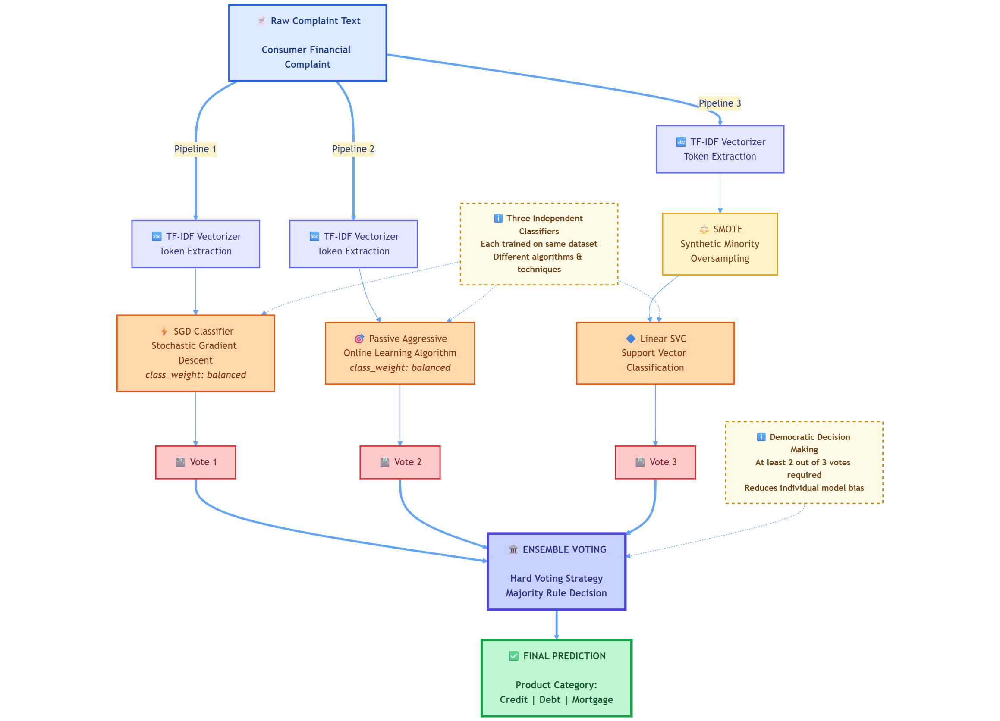
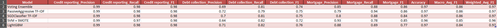
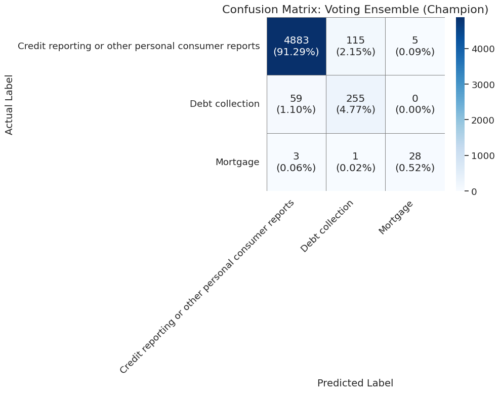

# 🎯 Complaint Classification Analysis

> **Comparing the top 5 ML strategies for imbalanced NLP classification**

A comprehensive study demonstrating that a Voting Ensemble approach outperforms standalone linear models (SGD, PA), SVM+SMOTE, and LightGBM for highly imbalanced consumer complaint classification.

[](https://www.python.org/)
[](https://scikit-learn.org/)
[](LICENSE)

---

## 📊 Dataset Overview

We utilized a focused, high-quality dataset from the Consumer Financial Protection Bureau (CFPB):

| Metric | Value |
|--------|-------|
| **Total Complaints** | 26,743 |
| **Source File** | `complaints-2025-11-01_06_26.csv` |
| **Class Distribution** | 93.5% imbalanced |

### 🔍 Source Filtering

To ensure data quality, the following filters were applied on the CFPB portal:

- ✅ Contains "Consumer complaint narrative"
- ✅ Product categories: `Credit reporting`, `Debt collection`, or `Mortgage`
- ✅ 100% complete dataset with no missing narratives

---

## 🛠️ Preprocessing Pipeline

Our preprocessing strategy focused on simplicity and effectiveness:

### Data Cleaning
- **Initial Filtering**: Pre-filtered at source for completeness
- **Code-Level**: Applied `dropna()` on `Product` and `Consumer complaint narrative` columns

### Text Vectorization
Leveraged scikit-learn's `TfidfVectorizer` and `CountVectorizer`:

```python
# Key preprocessing steps (automated):
- Lowercase conversion
- English stop words removal
- Term frequency filtering (min_df=5, max_df=0.9)
- Numerical vector transformation
```

### ⚖️ Imbalance Treatment

The **critical challenge**: 93.5% class imbalance

We implemented two complementary strategies:

1. **Algorithmic Balancing** → `class_weight='balanced'`
2. **Data-Level Balancing** → SMOTE (Synthetic Minority Over-sampling Technique)

---

## 🔬 Methodology

Our systematic approach progressed through four distinct phases:

### Phase 1: Baseline Establishment
**The Problem Case**

- Trained standard models (LinearSVC, RandomForest) on raw imbalanced data
- **Result**: 96-97% accuracy (misleading)
- **Reality**: F1-score for rare 'Mortgage' class = 0.32 ❌

### Phase 2: Alternative Solutions

#### 🅰️ Alternative 1: Algorithmic Balancing
- **Models**: SGDClassifier, PassiveAggressiveClassifier
- **Approach**: `class_weight='balanced'` parameter
- **Advantage**: Simple, one-line implementation

#### 🅱️ Alternative 2: Data-Level Balancing
- **Model**: LinearSVC with SMOTE
- **Approach**: Synthetic data generation for minority classes
- **Advantage**: Addresses imbalance at the data level

#### 🅲 Alternative 3: Advanced Model Architecture
- **Model**: LightGBM (Gradient Boosting)
- **Approach**: Non-linear, tree-based learning
- **Goal**: Compare against failed RandomForest baseline

### Phase 3: Champion Model
**🏆 Voting Ensemble Architecture**

Our final solution combines the three best-performing models:

```
┌─────────────────────────────────────┐
│      Voting Ensemble (Hard)         │
│  "Democracy-based" Classification   │
└─────────────────────────────────────┘
           │
    ┌──────┴──────┬──────────────┐
    │             │              │
┌───▼────┐  ┌────▼─────┐  ┌────▼─────┐
│  SGD   │  │ Passive  │  │   SVM    │
│Balanced│  │Aggressive│  │ + SMOTE  │
└────────┘  └──────────┘  └──────────┘

Prediction = Majority Vote (≥2 models agree)
```

**Why Ensemble?** Increased robustness through consensus voting reduces single-model prediction errors.

---

## 🚀 Getting Started

### Prerequisites
- Python 3.8+
- pip package manager

### Installation

#### 1️⃣ Clone the Repository
```bash
git clone [YOUR_GITHUB_REPO_LINK]
cd [YOUR_REPO_NAME]
```

#### 2️⃣ Create Virtual Environment (Recommended)
```bash
python -m venv venv

# Activation:
source venv/bin/activate       # macOS/Linux
venv\Scripts\activate          # Windows
```

#### 3️⃣ Install Dependencies
```bash
pip install pandas scikit-learn imbalanced-learn matplotlib seaborn lightgbm
```

### 🎯 Running the Models

Execute any of the five model scripts:

```bash
# 🥇 Champion Model - Voting Ensemble
python run_model_1_voting_ensemble.py

# 🥈 Runner-up - PassiveAggressive
python run_model_2_passive_aggressive.py

# 🥉 Third Place - SGDClassifier
python run_model_3_sgd_classifier.py

# 4️⃣ SVM + SMOTE
python run_model_4_svm_smote.py

# 5️⃣ LightGBM
python run_model_5_lightgbm.py
```

### 📈 Output

Each script generates:
- 📊 **Console Output**: Complete classification report with metrics
- 🖼️ **Visualization**: Professional confusion matrix saved as PNG

Example: `confusion_matrix_voting_ensemble.png`

---

## 🎨 Architecture Visualization

The Voting Ensemble workflow architecture:



---

## 🧪 Experimental Results

### Baseline Comparison

Our engineered models were evaluated against:

| Baseline Type | Model | Performance |
|--------------|-------|-------------|
| **Standard Unbalanced** | RandomForest, LinearSVC | ❌ Failed (F1 = 0.32) |
| **Advanced Baseline** | DistilBERT (1-epoch) | ⚠️ Outperformed by ensemble |

### Project Workflow
.png)

---

## 📊 Performance Metrics

**Key Performance Indicators:**
- **Macro Average F1-Score**: Overall model balance
- **Per-Class F1-Score**: Focus on rare 'Mortgage' class

### Top 5 Models Comparison


### 🏆 Best Performing Models

#### Model #1: Voting Ensemble


#### Model #2: PassiveAggressive (Balanced, CountVec)


---

## 💡 Key Findings

### The Journey

1. **Starting Point**: Real-world CFPB dataset with 93.5% class imbalance
2. **Baseline Reality Check**: 97% accuracy ≠ good model (vanity metric)
3. **Root Cause**: Visualizations revealed F1-scores as low as 0.32 for minority classes
4. **Core Problem Identified**: Severe class imbalance

### Solutions Tested

| Strategy | Technique | Result |
|----------|-----------|--------|
| **Algorithmic** | `class_weight='balanced'` on SGD, PA | ✅ F1 improved to 0.84+ |
| **Data-Level** | SMOTE on LinearSVC | ✅ F1 improved to 0.84+ |
| **Ensemble** | Voting combination of top 3 | 🏆 **F1 = 0.86** |

### 🎓 Lessons Learned

> **Well-engineered "classic" ML solutions can outperform deep learning for specific tasks**

- ✅ Voting Ensemble achieved **0.86 Macro F1-Score**
- ✅ **Simpler** than deep learning alternatives
- ✅ **Faster** training and inference
- ✅ **More robust** through consensus voting
- ✅ Outperformed baseline DistilBERT on this imbalanced task

---

## 🤝 Contributing

Contributions are welcome! Please feel free to submit a Pull Request.

---

## 📄 License

This project is licensed under the MIT License - see the [LICENSE](LICENSE) file for details.

---

## 📧 Contact

For questions or collaboration opportunities, please open an issue or contact the maintainers.

---

<div align="center">

**⭐ If you found this project helpful, please consider giving it a star!**

</div>